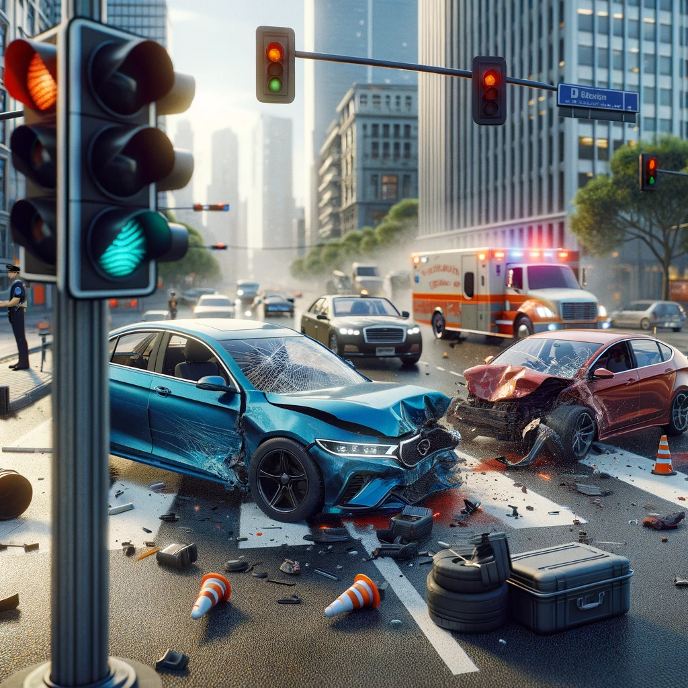

# Image Processing with Tools4AI

## Introduction

Agentic AI systems traditionally rely on text-based inputs for function calls and tool integration, limiting their ability to understand and act in real-time, especially in dynamic or visually-rich environments. These systems lacked the capacity to autonomously process and interpret images, restricting their ability to take immediate, contextually relevant actions. However, with the integration of advanced agentic AI, these systems can now perceive visual data, reason in context, and autonomously execute tasks based on both textual and image inputs, enabling a more intuitive, responsive, and action-oriented AI experience.

Tools4AI has introduced a feature that extends the functionality of AI beyond text-based interactions to include image-based action triggers.

> **Note:** All the images in this example have been generated by AI and are available here for testing.

## Innovative Image Recognition Integration

Tools4AI uses Gemini (gemini-1.0-pro-vision) to enhance AI capabilities by enabling the system to analyze images and automatically execute relevant actions based on the visual data it processes. This development is particularly crucial in emergency management, where speed and accuracy of response can save lives and property.

### Basic Image Processing Example

Here's the basic code you'll need to process images and take actions:

```java
package org.example.image;
import com.t4a.processor.AIProcessingException;
import com.t4a.processor.GeminiImageActionProcessor;
import com.t4a.processor.GeminiV2ActionProcessor;

public class ImageActionExample {
    public static void main(String[] args) throws AIProcessingException {
        GeminiImageActionProcessor processor = new GeminiImageActionProcessor();
        String imageDisription = processor.imageToText(args[0]);
        GeminiV2ActionProcessor actionProcessor = new GeminiV2ActionProcessor();
        Object obj = actionProcessor.processSingleAction(imageDisription);
        String str  = actionProcessor.summarize(imageDisription+obj.toString());
        System.out.println(str);
    }
}
```

### Emergency Response Example



When you execute the ImageActionExample with the above image as source, it correctly identifies that we need to call an ambulance. The system detects a car accident involving a blue car and a red car on a city street, with front-end and rear-end damage respectively, and a police officer present at the scene.

Here's the action handler for emergency services:

```java
@Predict(actionName = "callEmergencyServices", description = "This action will be called in case of emergency", groupName = "emergency")
public class EmergencyAction implements JavaMethodAction {
    public String callEmergencyServices(@Prompt(describe = "Ambulance, Fire or Police") String typeOfEmergency) {
        return typeOfEmergency+" has been called";
    }
}
```

### Vehicle Service Example


The integration of image recognition allows Tools4AI to directly interact with other digital systems and services. For instance, detecting a flat tire from traffic camera footage can trigger a roadside assistance call.

```java
@Predict(actionName = "carRepairService", description = "This action will be called in case of car servicing", groupName = "car services")
public class CarServiceAction implements JavaMethodAction {
    public String carRepairService(String typeOfProblem) {
        return typeOfProblem+" has been found and will be fixed";
    }
}
```

### Fire Emergency Example


Tools4AI correctly identifies and calls the emergency services when it detects a house fire. The system can recognize a building engulfed in flames and automatically alert fire services.

## Key Benefits

1. **Direct Action from Visual Cues**: Whether it's a surveillance image of a car accident or a live feed of a residential fire, Tools4AI can immediately recognize critical situations and initiate appropriate emergency protocols without human input.

2. **Reduced Dependency on Textual Reports**: By reducing the reliance on text-based alerts, Tools4AI allows for a more agile response strategy, directly linking what the camera "sees" to the necessary emergency service.

3. **Scalable and Versatile Applications**: The technology is scalable across multiple environments, enhancing security and response mechanisms in both public and private sectors.

## Future Applications

The potential applications of image recognition combined with function calling are vast:

- **Healthcare**: Analysis of x-rays or MRI scans to automatically identify abnormalities
- **Retail**: Visual search capabilities for product identification and recommendations
- **Security**: Automated detection of unauthorized access or suspicious activities
- **Environmental Monitoring**: Tracking landscape changes, wildlife, and environmental violations
- **Smart Homes and IoT**: Resident identification and safety hazard monitoring
- **Agriculture**: Crop health assessment, yield prediction, and pest infestation detection

## Complete Implementation Example

```java
package org.example.image;

import com.t4a.annotations.Action;
import com.t4a.annotations.Predict;
import com.t4a.annotations.Prompt;
import com.t4a.api.JavaMethodAction;

@Predict(groupDescription = "This group will be called in case of emergency", groupName = "emergency")
public class EmergencyAction {
    @Action(description = "This action will be called in case of emergency")
    public String callEmergencyServices(@Prompt(describe = "Ambulance, FireTruck or Police") String typeOfEmergency,
                                      boolean isEmergencyVehicleOnScene) {
        if(isEmergencyVehicleOnScene) {
            return typeOfEmergency + " has not been called since its already on scene";
        } else {
            return typeOfEmergency + " has been called since it was not there on scene";
        }
    }
}