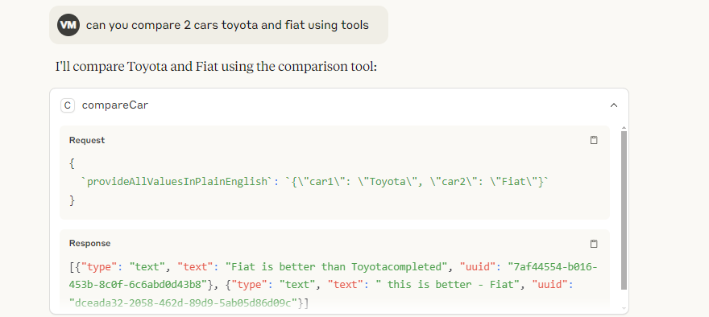

# MCP Server in Java with a2ajava – The Swiss Knife for Agentic Applications

## Overview

Let's build a lightweight Model Context Protocol (MCP) server in Java using the powerful and flexible a2ajava library. The a2ajava library is a "swiss knife" for building agentic applications in multiple languages such as Java and Kotlin, supporting multiple protocols.


### Key Features 🚀

- ✅ **Cross-protocol**: Supports both MCP (Model Context Protocol) and Google A2A (Agent-to-Agent)
- ✅ **Cross-platform**: Runs on any OS with JVM support
- ✅ **Cross-language**: Compatible with clients built in JavaScript, Python, or even LLM agents like Claude and Google A2A client
- ✅ **Flexible Implementation**: Use Spring Boot, Quarkus, or pure Java/Kotlin


## Implementation Guide

### Step 1: Create Basic Agent

Create a simple Java class to handle MCP requests. Here's a basic example:


```java
@Service
@Log
@Agent(groupName ="raiseTicket", groupDescription = "Create a ticket for customer")
public class RaiseCustomerTicket {
    @Action(description = "Raise a ticket for customer")
    public String raiseTicket(String customerName) {
        return "ticket 111 raised for " + customerName;
    }
}
```

> **Note**: If you're not using Spring/Spring Boot, you can ignore the `@Service` annotation and directly use `@Agent` and `@Action` annotations.


### Step 2: Create MCP Controller

Create a controller by extending `MCPToolsController`. This handles the MCP protocol endpoints:

```java
@Log
@RestController
@RequestMapping("/mcp")
public class MCPController extends MCPToolsController {
    // Base configuration endpoint
    @GetMapping("/server-config")
    public ResponseEntity<Map<String, String>> getServerConfig() {
        return super.getServerConfig();
    }

    // Tool listing endpoint
    @GetMapping("/list-tools")
    public ResponseEntity<Map<String, List<Tool>>> listTools() {
        Map<String, List<Tool>> response = new HashMap<>();
        response.put("tools", super.getToolsResult().getTools());
        return ResponseEntity.ok(response);
    }

    // Tool execution endpoint
    @PostMapping("/call-tool")
    public ResponseEntity<JSONRPCResponse> callTool(@RequestBody ToolCallRequest request) {
        CallToolResult result = super.callTool(request, new MCPActionCallback());
        JSONRPCResponse response = new JSONRPCResponse();
        response.setId("133");
        response.setResult(result);
        return ResponseEntity.ok(response);
    }
}
```

### Step 3: Configure package.json

Create a `package.json` file for the Node.js components:

```json
{
  "name": "mcp-sqlagent-server",
  "version": "0.1.1",
  "description": "MCP server for interacting with SQL databases.",
  "license": "MIT",
  "type": "module",
  "dependencies": {
    "@modelcontextprotocol/sdk": "^1.0.3"
  }
}
```

### Step 4: Create mcpserver.js

This file handles the communication between your Java server and MCP clients:

```javascript
import { Server } from "@modelcontextprotocol/sdk/server/index.js";
import { StdioServerTransport } from "@modelcontextprotocol/sdk/server/stdio.js";

const SERVER_BASE_URL = process.env.SERVER_BASE_URL || "http://localhost:7860";

const server = new Server({
  name: "springboot-proxy",
  version: "1.0.0",
}, {
  capabilities: {
    tools: {},
  },
});

// Tool listing handler
server.setRequestHandler(ListToolsRequestSchema, async () => {
  const response = await fetch("http://localhost:7860/mcp/list-tools");
  const data = await response.json();
  return { tools: data.tools };
});

// Tool execution handler
server.setRequestHandler(CallToolRequestSchema, async (request) => {
  const response = await fetch("http://localhost:7860/mcp/call-tool", {
    method: "POST",
    headers: { "Content-Type": "application/json" },
    body: JSON.stringify({
      name: request.params.name,
      arguments: request.params.arguments ?? {},
    }),
  });
  const data = await response.json();
  return data.result;
});

// Launch server
async function runServer() {
  const transport = new StdioServerTransport();
  await server.connect(transport);
}

runServer().catch(console.error);
```

### Step 5: Claude Desktop Configuration

Add the following configuration to your Claude Desktop settings:

```json
{
  "customerserviceagent": {
    "command": "node",
    "args": [
      "/work/springactions/src/main/resources/mcpserver.js"
    ]
  }
}
```



## Testing Your Server

Once you start the server, you can verify the available tools by visiting:
http://localhost:7860/mcp/list-tools

The response will show all registered tools with their descriptions and input schemas.

## Next Steps

1. Add more tools and agents to expand functionality
2. Implement error handling and logging
3. Add authentication if needed
4. Create client applications to interact with your MCP server

For the complete source code and more examples, visit the GitHub repository.